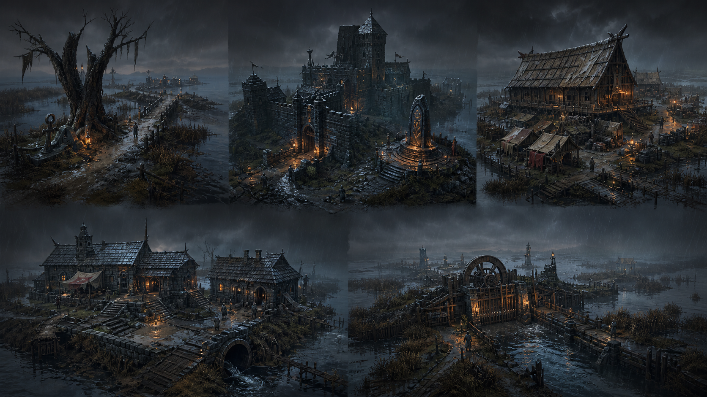

# Ashen Diorama Visual Bible

**Status:** Phase 0 production baseline  
**Version:** 0.1 — 2026-08-14  
**Applies to:** the 2.5D rebuild of *Ash Witness: The Same Rain*

## Visual promise

Greyfen should feel like a rain-dark stage set the player can enter: tactile 3D architecture and terrain, deliberately pixel-articulated 2D people, and light that makes every refuge, threat, and route legible. The result is an original **Ashen Diorama** presentation—not a reproduction of any existing game's assets, layouts, UI, characters, or branded visual identity.

Five principles govern every production decision:

1. **Readable diorama depth.** Foreground, play plane, architecture, and horizon form distinct layers at gameplay scale.
2. **Materials carry history.** Wet basalt, soaked timber, patched canvas, mud, rust, reeds, and black water show how Greyfen survives.
3. **Cold rain meets chosen warmth.** Rain-blue and fen-teal establish tension; amber ward-light marks people protecting one another.
4. **People remain human-scale.** Architecture may intimidate, but characters, shelters, work spaces, and navigable routes prevent spectacle from erasing the story.
5. **Restraint creates beauty.** Pixel accents, bloom, depth of field, fog, particles, and color grading support readability and mood; none may become a screen-wide filter.

## Originality rules

- “Ashen Diorama” is the only project-facing name for this visual direction.
- Reference games may be studied for general techniques such as mixing flat figures with dimensional environments. Their names must not appear in generation prompts, asset filenames, marketing copy, or shader/resource names.
- Do not trace, photobash, recolor, or rebuild a recognizable third-party scene, sprite, costume, UI frame, logo, palette, or composition.
- Generated concepts are mood and production guides. Final meshes, textures, sprites, portraits, effects, and UI are rebuilt for Greyfen and retain editable sources.
- All generated or externally sourced material requires an entry in `assets/ashen/asset_manifest.json`. Unrecorded assets do not enter a release build.
- No downloaded production art is assumed. If a later phase genuinely needs a third-party resource, it must be license-compatible, locally archived with its license, and explicitly attributed before use.

## Presentation lock

### World and camera

- The environment is real 3D geometry; gameplay movement is on the XZ plane with Y as height.
- The travel camera is orthographic at a fixed 45° yaw and approximately 35° downward pitch.
- Reference presentation is 1920 × 1080. The initial orthographic height is 16 m, yielding roughly 28.4 m of horizontal coverage at 16:9.
- Travel camera rotation is locked. Authored cinematics may move within ±15° yaw while the same directional sprite remains credible; wider moves require a matching sprite direction.
- Named actors should read at approximately 90–120 screen pixels tall at the reference framing.
- Camera smoothing uses a small dead zone. Reduce Motion disables smoothing overshoot, dialogue pushes, impact shake, and decorative camera rails.
- Roofs and tall foreground walls use authored occlusion volumes and a stable dither fade. The camera never hides the player behind opaque architecture.

### World scale and exploration

- One Godot unit equals one metre. Modular architecture snaps to 1 m horizontally and 0.25 m vertically.
- The production world uses seven connected chunks in one coordinate space: Anchor Hollow, West Causeway, West Gate/Barracks, Keep/Oathstone, Granary/Refuge Row, Clinic/Drains, and Water Gate/Fen Edge.
- The initial concept sheet compresses those chunks into five visual families; it does not reduce the seven-chunk exploration target.
- The finished world targets at least 24 camera-screen equivalents, a 90–120 second direct walk from western anchor to water gate, three alternate routes, and four knowledge-opened shortcuts for later Returns.
- Main routes are 1.4 m or wider. Narrow optional passages may reach 1.1 m only after collider clearance testing.

## Palette

| Role | Color | Use |
| --- | --- | --- |
| Ash black | `#11181B` | Deepest architecture and UI field; never crush navigable detail into it |
| Wet basalt | `#283238` | Fortress mass and neutral shadow |
| Rain blue | `#587688` | Sky light, rain and exposed planes |
| Fen teal | `#214A4D` | Water, marsh atmosphere and reflected cold light |
| Weathered canvas | `#9A907C` | Refuge structures, cloth and readable midtones |
| Soaked timber | `#5B4635` | Granary, bridges, props and warm neutral structure |
| Oxidized bronze | `#806444` | Hardware, ward housings and aged accents |
| Ward amber | `#E0A24B` | Safety, consent, inhabited spaces and contribution cues |
| Evidence cyan | `#70C3C9` | Focus, observed facts and phone-light accents |
| Ember red | `#A64F42` | Immediate danger only; never a general decorative accent |

At gameplay exposure, road edges, doors, bridges, interaction silhouettes, and actor faces must remain readable in grayscale. Cold and warm accents reinforce that value structure; they do not replace it.

## Environment language

### Form

- Fortress silhouettes are asymmetrical, repaired, and practical: broad buttresses, short defensive towers, steep rain roofs, exposed drainage, and additions from different periods.
- Greyfen is a frontier fort, not a monumental royal citadel. Production should reduce the concept sheet's most gothic or oversized forms while preserving its layered basalt mass.
- Refuge Row reads as homes under pressure, not an enemy camp: maintained canvas, domestic light, work surfaces, drying lines, shared water, and safe paths.
- Paths curve around water and repair work. They should promise reachable destinations, shortcuts, and partially concealed side routes from a single fixed camera.
- Repetition is broken with silhouette modules, repair patches, vertex color, decals, prop clusters, and controlled rotation—not noisy material variation.

### Materials

- Use hand-painted stylized PBR rather than photographic scans.
- Architectural and hero surfaces target 256 px/m; broad background surfaces may use 128 px/m; small evidence props may use 512 px/m.
- Standard exports are albedo plus packed ORM, normal, emission where required, and a separate wetness mask for rain response.
- Albedo keeps directional lighting out of the paint. Roughness, normal detail, baked lighting, and wetness create the scene's light response.
- Wetness darkens albedo modestly, lowers roughness, and adds broken highlights only on upward or exposed surfaces. Nothing should look uniformly lacquered.
- Reeds, grass, stones, loose boards, and repeated small props use atlases and `MultiMeshInstance3D` where appropriate.

### Production asset target

- 30 modular fortress pieces.
- 15 fen, reed, tree, bank, and water-edge modules.
- 35 props and story-specific hero objects.
- 12 reusable material families.
- 16–20 wetness, mud, moss, ash, crack, track, and puddle decals.
- Seven assembled district scenes, each with authored collision, navigation, lighting, occlusion, and vista markers.

## Character and portrait language

### World sprites

- Characters are original 2D sprite billboards placed in the 3D world. They use crisp silhouettes and selected pixel articulation rather than deliberately crude or low-information sprites.
- Named-actor frames use an 80 × 112 pixel working canvas, feet centred on the bottom anchor, then display at a consistent 1.70–1.80 m world height.
- Evan and the three enemy archetypes receive eight directions. Mostly stationary named NPCs receive four directions; any NPC that walks during a scene receives eight-direction travel frames.
- Evan's minimum set is idle 4, walk 8, sprint 8, dodge 6, shove 6, focus 4, hurt 3, and down/recover 8 frames per required direction.
- Enemy minimum set is idle 4, patrol 8, chase 8, notice 4, strike 6, stunned 4, and surrender 8 frames per required direction.
- Named NPCs require idle 4, talk 6, signature gesture 6, and walk 8 when mobile.
- Sprite sources begin as original Blender rigs and clothing, rendered at 4× with albedo, normal, depth, and emission passes. Frames are downsampled, palette-shaped, and hand-cleaned in Krita or Pixelorama.
- Runtime sprite materials use nearest sampling, stable alpha cut/opaque prepass, a camera-relative normal treatment, and a separate soft contact shadow. Transparent fringe and sorting shimmer are release blockers.

### Cast scope

- Ten named world sets: Evan, Mara, Tamsin, Lysa, Nessa, Brann, Kesh, Piri, Tomas, and Corvin.
- Three original agent archetypes with equipment and palette variants.
- Six civilian/refugee variations, including ordinary Daevar silhouettes; horns are anatomy and heritage, never monster coding.
- Eleven 1024 × 1024 dialogue busts, each with neutral, guarded/distressed, and resolved expressions. The narrator may use an environmental crest treatment rather than a human face.

## Lighting and atmosphere

- Forward+ is the reference renderer. A Low profile substitutes ordinary depth/height fog and layered fog cards for volumetric fog, disables depth of field, reduces shadowed lights, and lowers particle density.
- `WorldEnvironment` establishes cool storm ambience, restrained filmic tonemapping, light bloom, depth fog, and color adjustment.
- `LightmapGI` supplies static indirect light per district. One cool storm `DirectionalLight3D`, reflection probes, and a limited number of dynamic ward lights affect moving actors.
- No more than four shadow-casting local lights should normally overlap a travel-camera view; remaining lanterns use baked bounce and emissive materials.
- Depth of field is subtle and never blurs the player, interactables, or route. It is High-only and can be disabled independently.
- The same 4:20 rain remains physically consistent across Returns. State grading changes perception, not time: baseline cold slate; pass two sharper cyan; pass three deeper contrast with an ash undertone; surviving line balances cyan rain with chosen amber warmth.

## Effects language

### Weather stack

1. Camera-following rain streaks, depth-sorted and wind-driven.
2. Near-ground splash and puddle-ripple emitters with particle collision.
3. Authored roof runoff, gutter overflow, drips, reed motion, and water impacts.

Low fog stays in the fen and drains; it does not wash the entire image gray. Lantern embers and smoke are localized. Lightning combines a sky/directional pulse, one distant cloud flash, wet-surface response, and delayed thunder timing. Reduce Flash clamps peak luminance and removes full-screen white frames.

### Gameplay effects

- Focus: thin evidence-cyan edge response and subtle rain refraction, not magic particles around every object.
- Shove: a short directional ribbon, mud or water kick, contact sparks only when striking metal, and a readable enemy recoil.
- Notice/chase: diegetic posture plus a compact UI cue; never a giant cone dominating the scene.
- Return: layered rain reversal, localized cyan/amber separation, depth-band distortion, then a quiet cut. Reduce Motion replaces distortion with a brief grade and sound cue.
- Effects are pooled. Decorative systems have High/Medium/Low emission ratios and cease outside their district visibility range.

## UI language

- UI remains a crisp `CanvasLayer`, independent of world post-processing.
- Surfaces combine translucent ash glass, narrow oxidized-bronze structure, warm parchment copy fields, and restrained ward-amber focus states.
- Dialogue gives the portrait and words breathing room; world detail remains visible but subdued behind it.
- Evidence, retained memory, and executed contributions retain their existing semantic distinction and use both icon shape and text—not color alone.
- Frames, ornament, typography hierarchy, map treatment, and folio layout must be original. No reference game's menu geometry or ornament is reproduced.

## Collision and navigability art contract

- Every blocking mesh ships with a simple named collision proxy authored in the same source scene. The visual mesh and proxy share origin, scale, and revision.
- Invisible collision is forbidden except an outer safety boundary placed beyond visible terrain. Boundaries inside the play area require a visible wall, rail, water hazard, rubble, or height change.
- Collision-to-visible-hard-surface discrepancy must remain within 0.10 m on traversable edges.
- Player capsule target is 0.35–0.40 m radius. Standard step lips are at most 0.20 m and walkable slopes at most 25°.
- Navigation is baked from the same collision proxies. Required objective pairs must share a valid route; ladders, drops, or shortcuts use explicit navigation links.
- Interactables use separate `Area3D` volumes and never enlarge a physical collider to make interaction easier.
- A developer build exposes collision, interaction, perception, occlusion, and navigation overlays. A 30-minute perimeter/door/bridge/ramp sweep with no snag, tunnelling, hidden wall, or unreachable objective is a phase gate.

## Selected Phase 0 concept

The selected 1672 × 941 concept establishes five readable district families, consistent three-quarter framing, wet material contrast, navigable path silhouettes, and the cold-rain/amber-refuge relationship. Visual inspection found no text, labels, logos, watermarks, UI, or recognizable borrowed characters.

Production corrections are explicit:

- Reduce the Keep's monumental gothic scale to a repaired frontier fortress.
- Lift selected midtones so gameplay paths and doors remain clear without relying on orange lights.
- Preserve the concept's restrained local warmth; do not turn every lantern into saturated bloom.
- Treat every structure as a new modular build. The concept is not a texture source, photobash source, or blueprint to trace.

Exact generation provenance and prompt are recorded in `assets/ashen/asset_manifest.json`.

## Visual acceptance gate

A district is not art-complete until:

- its landmark and main route are identifiable at gameplay zoom and in grayscale;
- no placeholder primitive, temporary generated texture, or unmanifested asset remains visible;
- player and NPC silhouettes remain readable against every approved light state;
- wetness, fog, bloom, depth of field, and particles retain surface detail and interaction readability;
- all hard visual boundaries match collision within 0.10 m;
- Reduce Motion, Reduce Flash, DOF Off, and Low quality preserve the scene's intended hierarchy;
- fixed-camera captures at 720p, 1080p, and 1440p pass visual review without shimmer, clipping, sorting errors, crushed values, or UI overlap.
